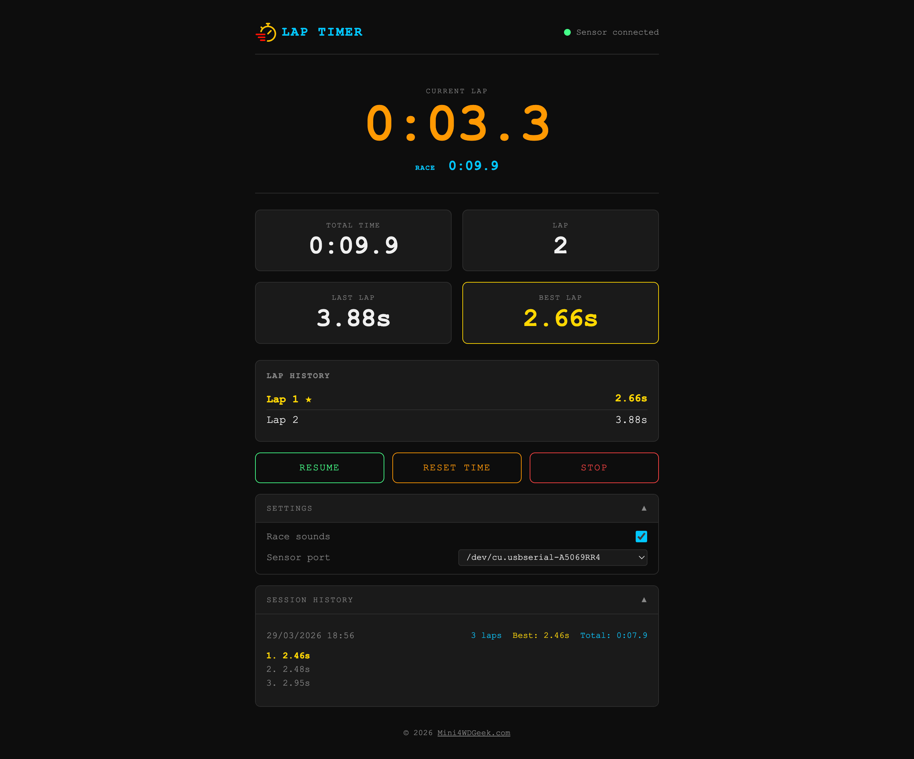
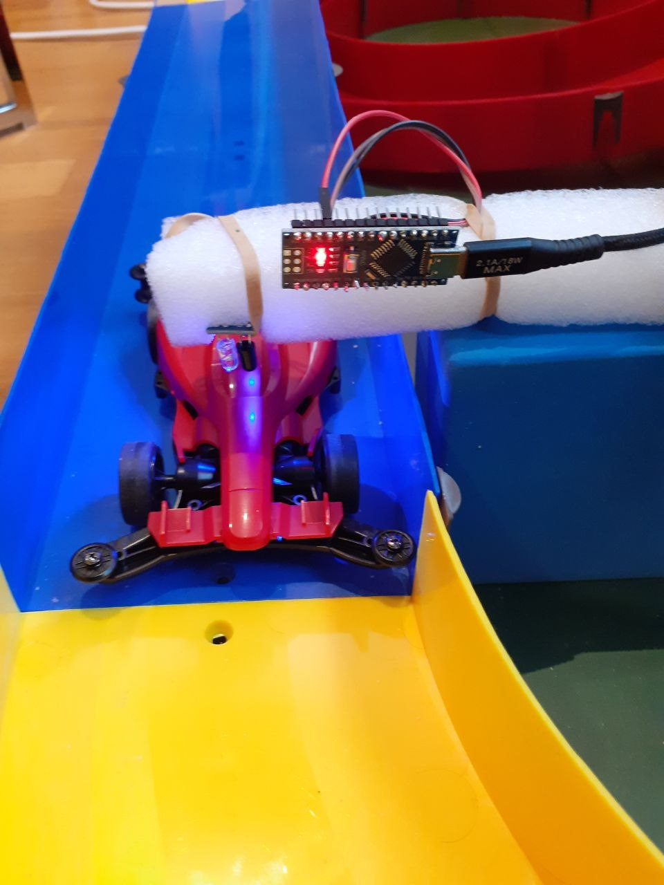

# Mini 4WD Racing Lap Timer

A real-time lap timer for Mini 4WD racing, built with Go and vanilla JavaScript. An Arduino with an IR sensor detects each car pass and triggers lap recording via serial port. Results are broadcast live to the browser over WebSocket.

[](LICENSE)

|  |  |
|:---:|:---:|

<div align="center">

### [📖 User Guide](docs/user-guide.md) &nbsp;&nbsp; [🔧 Arduino Setup](docs/arduino-setup.md)

</div>

## Features

-   Real-time current lap and total race time display
-   Lap history with best lap highlighted
-   Pause, resume, and reset support
-   Session history saved to disk
-   Race sounds (countdown, GO, lap bell, best lap arpeggio)

## Requirements

-   [Go 1.22+](https://go.dev/dl/)
-   Arduino with IR sensor connected via USB serial

## Hardware Setup

1.  Connect the IR receiver output to Arduino **D2**
2.  Flash the sketch at `arduino/lap_sensor/lap_sensor.ino`
3.  Connect the Arduino to the computer via USB

The Arduino sends a `TRIGGER` line over serial (9600 baud) each time the IR beam is broken, with a 500 ms debounce.

## Running

```bash
go run ./cmd/server
```

Then open `http://localhost:8080` in a browser.

### Options

<table border="1" cellpadding="8" cellspacing="0">
  <thead>
    <tr>
      <th>Flag</th>
      <th>Default</th>
      <th>Description</th>
    </tr>
  </thead>
  <tbody>
    <tr>
      <td><code>-port</code></td>
      <td><code>/dev/ttyUSB0</code></td>
      <td>Serial port the Arduino is connected to</td>
    </tr>
    <tr>
      <td><code>-addr</code></td>
      <td><code>:8080</code></td>
      <td>HTTP listen address</td>
    </tr>
  </tbody>
</table>

Example:

```bash
go run ./cmd/server -port /dev/tty.usbmodem101 -addr :9000
```

## Session Data

Completed sessions are saved as JSON files in the `sessions/` directory. The in-app session history panel loads them on demand.

## Useful Links

- [Mini4WDGeek.com](https://Mini4WDGeek.com) — Mini 4WD news, reviews, and resources

## Project Structure

```
cmd/server/        - HTTP server, WebSocket, REST endpoints
internal/
  session/         - Lap timing state machine
  hub/             - WebSocket broadcast hub
  serial/          - Serial port listener
  storage/         - Session persistence
static/            - Frontend (HTML, CSS, JS)
arduino/           - Arduino IR sensor sketch
sessions/          - Saved session JSON files (git-ignored)
```