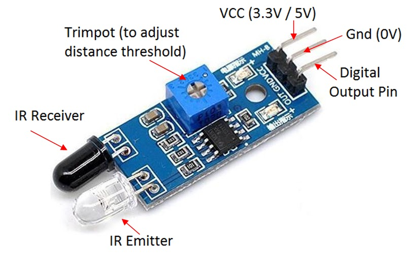
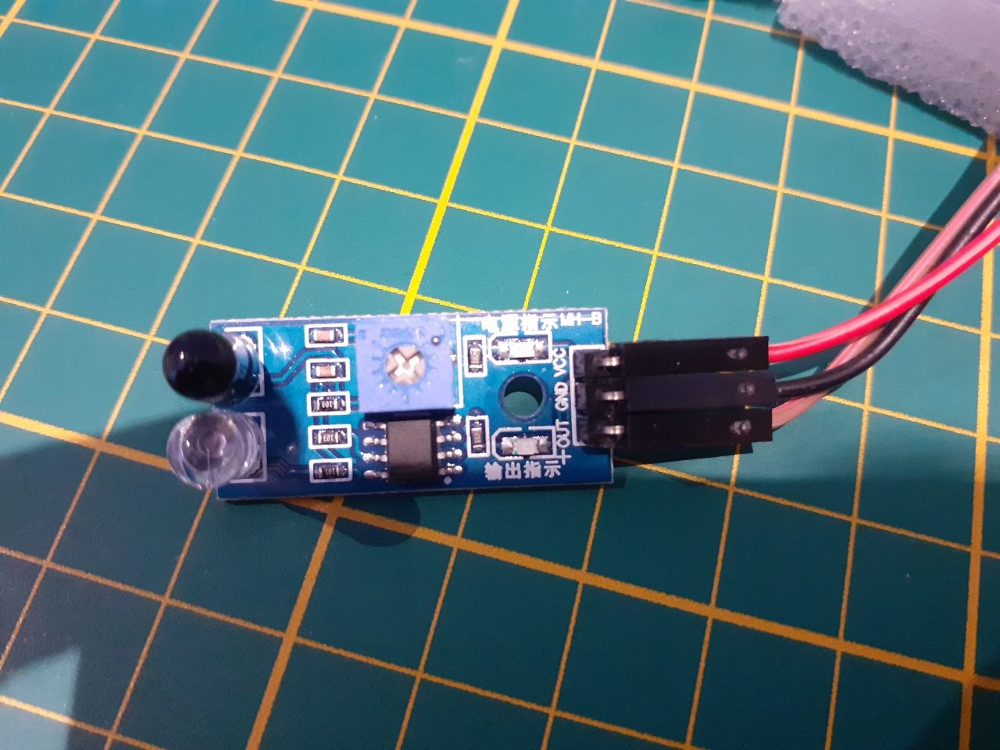
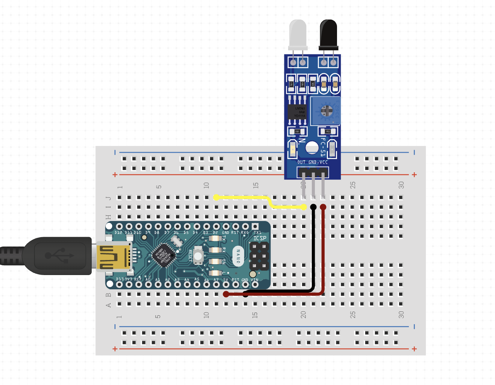
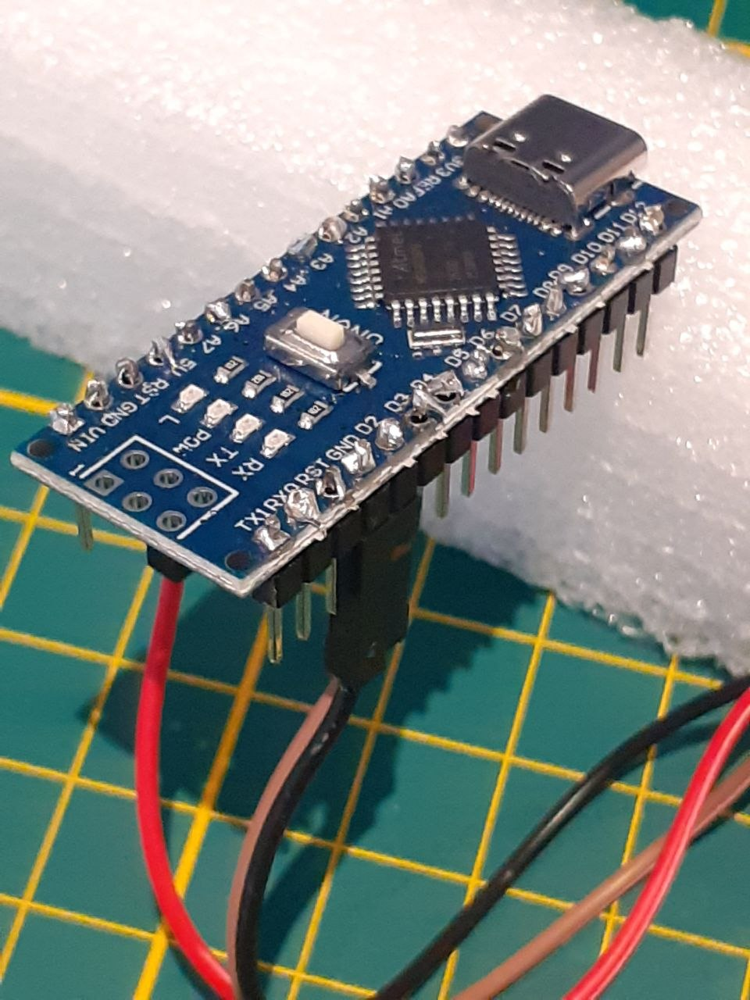

# Arduino & IR Sensor Setup

This guide walks you through wiring the IR sensor to an Arduino Nano and uploading the lap timer sketch.

---

## What You Need

-   Arduino Nano (or compatible clone with USB-C or Mini-USB)
-   IR obstacle sensor module (FC-51 / MH-B or similar)
-   3 jumper wires (female-to-female or female-to-male)
-   USB cable (matching your Arduino)
-   A computer with the Arduino IDE installed

---

## 1. Understanding the IR Sensor



The sensor module has three pins on one end:

<table border="1" cellpadding="8" cellspacing="0">
  <thead>
    <tr>
      <th>Pin</th>
      <th>Description</th>
    </tr>
  </thead>
  <tbody>
    <tr>
      <td><strong>VCC</strong></td>
      <td>Power — connect to <strong>5V</strong> on the Arduino</td>
    </tr>
    <tr>
      <td><strong>GND</strong></td>
      <td>Ground — connect to <strong>GND</strong> on the Arduino</td>
    </tr>
    <tr>
      <td><strong>OUT</strong></td>
      <td>Digital output — connect to <strong>D2</strong> on the Arduino</td>
    </tr>
  </tbody>
</table>

The small blue **trimpot** on the module adjusts detection sensitivity/distance. Turn it clockwise to increase range, counter-clockwise to reduce it.



---

## 2. Wiring



Connect the three sensor pins to the Arduino Nano as follows:

<table border="1" cellpadding="8" cellspacing="0">
  <thead>
    <tr>
      <th>Sensor Pin</th>
      <th>Arduino Nano Pin</th>
    </tr>
  </thead>
  <tbody>
    <tr>
      <td>VCC</td>
      <td>5V</td>
    </tr>
    <tr>
      <td>GND</td>
      <td>GND</td>
    </tr>
    <tr>
      <td>OUT</td>
      <td>D2</td>
    </tr>
  </tbody>
</table>

The wiring diagram above uses a breadboard for clarity, but you can connect the jumper wires directly from the sensor to the Arduino header pins.



---

## 3. Install the Arduino IDE

1.  Go to [https://www.arduino.cc/en/software](https://www.arduino.cc/en/software)
2.  Download the **Arduino IDE 2** for your operating system (Windows, macOS, or Linux)
3.  Run the installer and follow the on-screen steps
4.  Launch the Arduino IDE

---

## 4. Add Arduino Nano Board Support

If you are using a clone Arduino Nano with the **CH340** USB chip (common on budget boards):

1.  Open **Arduino IDE → Preferences**
2.  In "Additional boards manager URLs" add:
    ```
    https://raw.githubusercontent.com/nanochip/arduino-boards/master/package_index.json
    ```
3.  Go to **Tools → Board → Boards Manager**, search for **Arduino AVR Boards**, and install it
4.  Go to **Tools → Board** and select **Arduino Nano**
5.  Go to **Tools → Processor** and select **ATmega328P (Old Bootloader)** if the standard option fails to upload

---

## 5. Open the Sketch

1.  In the Arduino IDE, open **File → Open**
2.  Navigate to the `arduino/lap_sensor/` folder in this project
3.  Open `lap_sensor.ino`

The sketch sends a `TRIGGER` line over serial (9600 baud) each time the IR beam is broken, with a 500 ms debounce to avoid duplicate triggers.

---

## 6. Upload the Sketch

1.  Connect the Arduino to your computer via USB
2.  Go to **Tools → Port** and select the port that appeared when you plugged in the Arduino
    -   On macOS/Linux it looks like `/dev/tty.usbserial-XXXX` or `/dev/ttyUSB0`
    -   On Windows it looks like `COM3`, `COM4`, etc.
3.  Click the **Upload** button (→ arrow icon) or press `Ctrl+U` / `Cmd+U`
4.  Wait for "Done uploading" to appear in the status bar

The built-in LED on pin 13 will flash briefly each time a trigger is detected — a quick way to confirm the sensor is working without opening the serial monitor.

---

## 7. Mount the Sensor on the Track

Position the sensor across the track so the IR beam is broken by the car as it passes. Keep the emitter and receiver facing each other at the same height as the car body.


Adjust the trimpot until the sensor LED lights up reliably when the car passes and turns off between passes.

---

## 8. Start the Lap Timer

Once the sketch is uploaded and the sensor is mounted, follow the [User Guide](user-guide.md) to start the Go server and begin timing laps.
