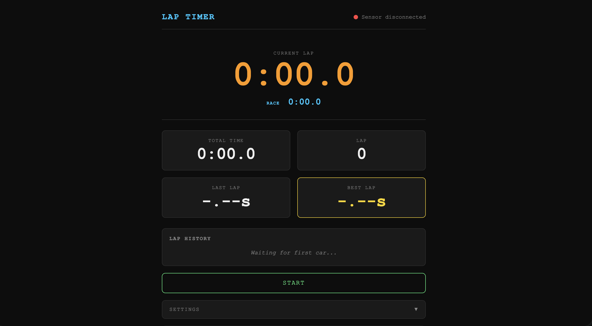
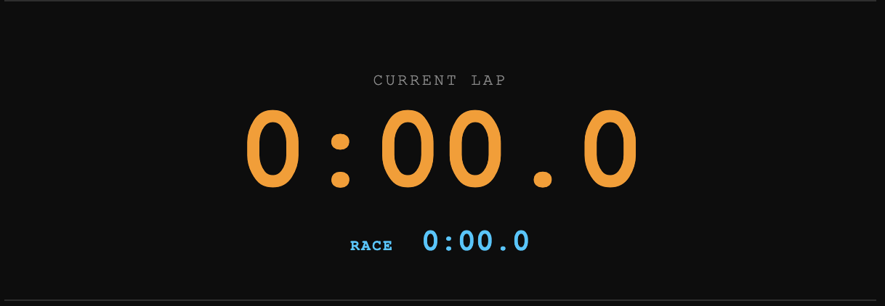
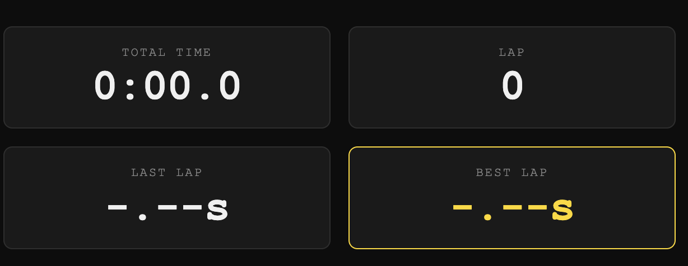
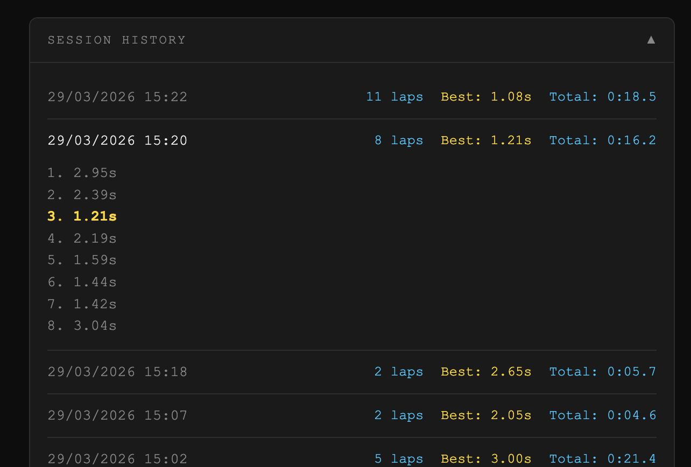
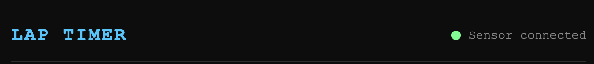
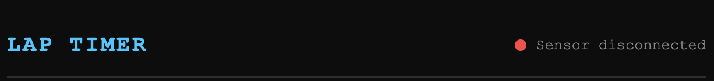

# Mini 4WD Lap Timer — User Guide

## Overview

The lap timer tracks your Mini 4WD car's lap times in real time using an IR sensor connected to an Arduino. Open `http://localhost:8080` in your browser to access the timer.

---

## Timers Layout

### Current Lap (large orange display)

Shows the time elapsed for the lap currently in progress. Resets to `0:00.0` at the start of each new lap.

### Race (blue display below)

Shows the total time elapsed for the entire race session, excluding any paused time.

### Scoreboard

Field

Location

Description

**Total Time**

Top left

Sum of all completed laps

**Lap**

Top right

Number of completed laps

**Last Lap**

Bottom left

Time of the most recently completed lap

**Best Lap**

Bottom right

Fastest lap of the session — highlighted in gold

### Lap History

A scrolling list of every completed lap. The best lap is marked with a ★.

---

## Buttons

### Start

Appears when the timer is idle. Arms the sensor and waits for the car to cross the IR beam for the first time. A 3-beep countdown plays to signal the timer is ready.

### Stop

Ends the race session immediately. The session is saved to history. A descending sound plays to confirm.

### Pause

Freezes both the current lap and race timers. The car's position is noted — use this when you need to interrupt a run.

### Resume

Appears after pausing. Clicking Resume puts the timer into a waiting state — **the timers do not start immediately**. Place the car at the track and let it pass the IR sensor; the moment it crosses, the race timer resumes and a fresh lap begins. A GO sound plays on the trigger.

### Reset Time

Appears when paused. Removes the current incomplete lap from the race timer without ending the session. Useful when you want to discard a partial lap before resuming.

### Reset

Clears all lap data and returns the timer to idle. The session is saved to history before resetting. A descending arpeggio plays to confirm.

---

## Race Sounds

Sounds can be toggled on or off in the **Settings** panel at the bottom of the page. The preference is saved between sessions.

Event

Sound

Start armed

3 short beeps (countdown)

Car crosses start line

Rising two-note GO burst

Lap completed

Bell ping

New best lap

Ascending arpeggio (C–E–G–C)

Pause

Descending two-tone

Resume clicked

Rising two-tone

Stop

Low descending blip

Reset Time

Soft tick

Reset

Descending arpeggio

---

## Typical Race Flow

1.  Click **Start** — 3 beeps confirm the sensor is armed
2.  Release the car — the timer starts the moment it crosses the IR beam
3.  Each time the car completes a lap, the lap time is recorded automatically
4.  Click **Stop** when the race is over — the session is saved
5.  Click **Reset** to clear and start fresh for the next race

## Pausing Mid-Race

1.  Click **Pause** — both timers freeze
2.  Optionally click **Reset Time** to discard the current partial lap
3.  Click **Resume** — the timer waits in a ready state
4.  Send the car through the IR beam — race resumes with a fresh lap

---

## Session History

Past sessions are stored and accessible via the **Session History** panel at the bottom of the page. Click the panel header to expand it, then click any session to see its individual lap times.

---

## Connection Status

The indicator in the top-right corner shows the live connection to the sensor:

-   **Green dot** — connected, sensor active

-   **Red dot** — disconnected, attempting to reconnect automatically